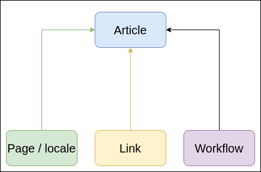
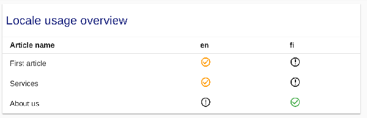
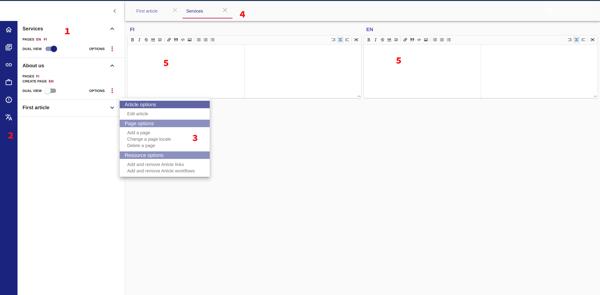

# Stencil CMS Alpha Käyttöohje

## Sisältö

* [Esittely](#Introduction)
* [Ominaisuudet](#Features)
  * [Artikkelit](#Articles)
  * [Sivut](#Pages)
  * [Linkit](#Links)
  * [Lomakkeet ja työnkulut](#Forms-and-workflows)
  * [Paikannukset](#Localisations)
  * [Julkaisut](#Releases)
* [Stencil-käyttöliittymän esittely](#Intro-to-UI-Layout)
* [Ensimmäisten resurssien luominen](#Creating-your-first-resources)
* [Resurssien poistaminen ja irrottaminen](#Deleting-and-removing-resources)


### Esittely

Stencil CMS on sisällönhallintajärjestelmä, joka on kehitetty luomaan ja hallinnoimaan staattista sisältöä usealla kielellä käyttäen [Markdown]-järjestelmää (https://www.markdownguide.org/). 

Stencil koostuu kahdesta osasta: 

* **Stencil CMS**: Pääasiallinen sovellus staattisen sisällön hallintaan, suunniteltu toimimaan yhdessä organisaatiosi Stencil Portal -käyttöliittymän kanssa.
* **Stencil Portal Käyttöliittymä**: Staattisen sisällön sivusto, jossa käyttäjät pystyvät lukemaan sisältöäsi, täyttämään lomakkeita, vastaanottamaan viestejä organisaatioltasi ja muuta. 

Tämä alusta vakauttaa ja yhdistää sisältösi, datankeruun ja prosessien automatisoinnin yhteen tilaan. 

Keskeiset filosofiat:

**Monikielisen sisällön tuottamisen tulisi olla tehokasta ja yksinkertaista.**  

Nykypäivänä monikielisen sisällön tuottaminen ja hallinta on olennaista. Kaiken Stencilissä on tarkoitus virtaviivaistaa sisällön tuottamisen ja kääntämisen prosesseja. Esimerkiksi Stencilin avulla kääntäjät voivat nähdä alkuperäisekielisen tekstin kirjoittaessaan käännettyä teksiä halkaistun näytön avulla. Aikaa säästyy ja työ helpottuu, kun ei ole tarpeen vaihdella näkymää ikkunasta toiseen. 

**Sisällön tuottajien ei tulisi tarvita hallita sisältöään useissa eri paikoissa samaan aikaan.**  

Stencilin avulla voit asettaa käännökset, linkit, kielet ja työnkulut kerran ja käyttää näitä resursseja ja niiden käännöksiä laajasti tai yksittäisesti. Jos linkin tekstiä tarvitsee muuttaa, se tehdään **yhdessä** paikassa ja muutokset päivittyvät kaikkialle missä linkkiä käytetään. Tai esimerkiksi on lomake, joka on useassa paikassa sovelluksessasi. Riittää, että lomaketta muokataan kerran, jotta se päivittyy kaikkialle missä se on käytössä. Näin vapautuu enemmän aikaa uuden sisällön tuottamiseen, kun ei tarvitse huolehtia siitä, miten monessa paikassa sisältöä pitää muokata.

**Datankeruu ja prosessien automatisointi ovat ensisijaisia elementtejä CMS ratkaisun kokonaisuudessa.**  

Sisällön tarjoaminen käyttäjille on mahtavaa. Parempaa vielä on kuitenkin tarjota käyttäjille mahdollisuus tehdä toimintoja sisällön kanssa sekä suunnitella prosesseja toimimaan tämän datan perusteella. Stencil toimii kahden muun alustan kanssa tarjotakseen lomake- ja prosessipalveluita. Uskomme, että organisaatioiden tulisi pystyä hallitsemaan kaikkia näitä kolmea elementtiä luodakseen täydellisesti tarpeisiinsa sopivan ratkaisun. 

**Versioiden hallinta on ehdottoman tärkeää.**  

Aikaa ja vaivaa säästyy, kun pidetään sekä yhtä todenmukaista lähdettä, että tarkistettua muutoshistoriaa. Tästä syystä Stencilin Release-ominaisuus mahdollistaa yksinkertaisten merkintöjen ja lisähuomioiden tekemisen, jolloin on mahdollista palata aikaisempaan työhön koska tahansa, tehdä vikatarkastuksia tai palauttaa työ aikaisempaan vaiheeseen.  

---

### Features

* Simple, multi-language content composition with Markdown syntax
* Simultaneous, side-by-site content editing for two languages (Dual View)
* Integrate forms and their workflows into static content
* Versioning and release management system
* Localisation capability for all content, links, forms, and workflows

---

## Basic User Guide

The Stencil is comprised of six different elements, which we can refer to as "Resources". These resources are as follows:

* **Articles**: Containers for grouping related resources  
* **Pages**: Localised Markdown content, directly connected to Articles   
* **Links**: Localised internal or external links  
* **Localisations**: Available languages for content  
* **Releases**: Versions / Snapshots of complete content state at one point in time
* **Workflows**: Localised forms and processes connected to Articles / Pages


### Articles

Articles can be thought of as containers for grouping related elements. An Article is the main "hub" which connects pages(localised content), links, and workflows. 




An Article **must** have a name (customisable) and at least one page. This name is purely technical and does not appear on the end-user side.  Articles without any pages will not be rendered on the end-user UI.

An Article **should** have a three-digit number in front of it. This number determines the order it is displayed in the menu.

Example of an Article with name and order number: `100_Housing`

An Article **may** have Links and Workflows associated with it, but this is not required.

Articles can be nested up to **two** levels. This means you can have one Parent Article and its Child Article.  Here is an example of a nested Article:

`150_Construction/100_Building_Permits`

Article display names on the end-user side are taken from the first Markdown Level 1 Header in each Page. 


Here is an example situation: You have an Article with two Pages: `en.md` and `et.md`. You want this article to appear to end-users with the name "Animals", but you want to be sure that, if a user has selected the Estonian language, the Estonian word appears instead of English. To do this, you simply give each Page a Level 1 Header with the appropriate name, and the system picks it up.

en.md

```markdown

# Animals

```

et.md

```markdown

# Loomad

```


---

### Pages  

Pages are Markdown files. They are named according to their content language, and contain only content written in that language. For example, a page named `en.md` contains English language content.  

The basic rule is this: 1 page == 1 locale. You can have as many pages per Article as you wish, depending on how many languages you need to represent, but currently, there can only be ONE page per Article of the same locale. 

Because a Page corresponds directly to a locale, Pages cannot exist if the desired locale doesn't exist. This means that, if you want a page in a language you haven't added yet, you'll need to add that locale first, and only then start creating pages that use it.

A Page **must** have at least 1 Markdown Level 1 Header. The first occurrence of a Level 1 Header within a Page will provide the localised name for the Article that the end user sees in your content portal's Topic menu.

A Page does not have a customisable name. The name of a page is always the [two-letter language code](https://en.wikipedia.org/wiki/ISO_639-1) corresponding to its content language, followed by `.md` file extension. For example, `sv.md` is a Swedish-language Markdown page.

A Page is specific to an Article, and it cannot exist outside of an Article. 

In summary, before creating a page, you need to keep three things in mind:

* The Article in which the page will "live" must already exist
* The locale for the Page's content must already exist
* The Page must include a Markdown level 1 Header, which will appear as a Topic in your portal's Topic menu.

---

### Links

Links can be **internal**, **external**, or **phone**. An internal link connects to pages within your domain, while an external link connects to pages outside your domain. A link of type "phone" will display as a telephone number on your Portal UI.

Links can be associated with any, all, or no articles / pages.  

Links are localised. The locale you specify for a link when creating it determines that this link will appear only on pages with the same locale. Here is an example situation:

You have an article: `100_Housing`.  This Article has two pages: `en.md` and `sv.md`. You create a link and set its locale to `en`. You then associate this link with your Article `100_Housing`. Your link will only appear on `en.md`, even though it was applied to the entire Article. If you want this link to appear on `sv.md`, you can give the link this additional localisation.

If you want a link to appear on ALL pages of an Article, regardless of language, simply leave the locale field blank.  

Once a link has been created, it is available globally throughout the application.
 
If you don't want a certain link to appear on a page anymore, you can remove a link's association with an Article at any time without deleting the link from the application. 

When you delete a link, it is deleted globally from the application.

---

### Forms and Workflows

The Stencil is designed to unify your content, data gathering, and process automation into one consolidated application. In practice, this means that you can set up your static content to point users to your forms, and you can create workflows which specify what happens once those forms are submitted.

For example, your organisation may want to provide a form for users to send an inquiry about a product, and then when a user completes and submits the inquiry form, a notification is sent to an administrator who then performs some action. Or, perhaps something automated should happen when this form is completed. This is all up to you to customise however you need. 

---

### Localisations

Localisations (locales) provide you with the ability to define the languages for your content. You can defined as many locales as you wish. 
  
Locales are created by specifying the [two-letter language code](https://en.wikipedia.org/wiki/ISO_639-1) of the desired language. These two-letter language codes will be used by the system to generate your Page "names" as well. In practice, this means that, if you create a locale for English (`en`), you will then have the option to create Pages in that locale, and they will automatically be named `en.md`.

Once a locale has been created, it is available globally throughout the application. You can then start creating / associating content such as pages, links, etc. with this locale.

The Stencil also provides a "Locale Usage Overview" where you can quickly and easily see which Articles have Pages (or don't have) for each of your activated languages. You can also see the Article - Locale usage table, which provides you a site-wide overview of the following:

* All articles in your site and all Locales for your site
* Article-Page summary
  * Articles with no page of a certain locale
  * Articles with a page of a certain locale, but there is no content
  * Articles with a page of a certain locale, and there is content



---

### Releases

With versioning and releases, you can keep a history of your content throughout time.  When you make a release in The Stencil, you create a snapshot of your **entire** content state at that point in time. Then, you can apply that release, whether it is a test or a production release. 

If it turns out that your release isn't what you were expecting, you can easily revert back to a previous release. 

---


## Intro to UI Layout

  

### 1: Explorer

Use the Explorer to view Articles and their associated resources.

### 2: Toolbar

The Toolbar contains shortcut links to everyday functionalities:

* Dashboard
* Articles View
* Links View
* Workflows View
* Releases View
* Locales View

#### Dashboard

The Dashboard (home icon in the Toolbar) is the centralised location from which you can create and modify Resources.

### 3: Article Options menu

Expand an Article in the Toolbar and click the three dots icon to open the Article Options menu. From here, you can easily work with Article Resources.

### 4: Tab bar

View all currently open Resources and switch between them smoothly.

### 5: Content Editor

Edit your content here. In the screenshot above, Dual View is enabled, which allows you to edit two languages side by side. This is useful for translating from one language to the other. 

**NOTE**: Dual View is only available if TWO OR MORE Pages exist in an Article. To enable Dual View:

1. Select one page and open it in the Content Editor
2. Click the Dual View switch
3. Click the second page you wish to open in the Content Editor.
4. To close the second page, simply click the Dual View switch again to deactivate it.

---

## Creating your first resources


#### Create an Article

Select "Create an Article" in the Explorer. (Note, this button only appears the first time you add an Article).  OR

Nagivate to the Dashboard (home icon in the toolbar) and create a new Article.

In the dialog window, leave "Parent Article" empty, as you don't have any other Articles yet.

Set the Order Number of your Article. The Order number dictates where the Article will appear in your portal's Topic menu. 

The number must be 3 digits. The lower the number, the higher the Article will appear in the Topic menu. For example, an Article with Order: 100 will appear *before* an Article with Order: 300.

Once you hit "Create", your first Article will be created in the Explorer. However, you don't yet have any Locales, so you also don't have any Pages. Expand your Article by clicking the expand arrow icon. You will be prompted to create your first Locale.

#### Create a Locale

You will see a notification that says: "No Locales". Click here to add one, which will enable you to start creating content.

When creating your locale:

Use the two-letter language code of the locale you want to add: Examples:

`en` : English  
`fi` : Finnish  
`sv` : Swedish  

#### Create a Page for your Locale
 
Once you have created a locale, you need to create a Page for that locale. In the expanded view of your Article, click "Create page" to do this.  
NOTE: Once you have created two or more pages, you can enable "Dual View", which will allow for side-by-side content editing of two languages at the same time.

#### Add Links, Workflows, and additional Locales

Links, Workflows, and additional Locales are added globally. You can create these in whatever order you wish from the Dashboard.

#### Associate Links and Workflows with Articles and Pages

Once Links / Workflows have been created, you can "associate" them with existing Articles. To associate a link or a Workflow with an Article, open the Article Options menu and select "Add and remove Article links" or "Add and remove Article Workflows".

The locale you specify for a link will automatically create the connection between that link and the correct Page within that Article.

#### Make a release

* When your content is ready, make a new Release. Give it a name and an optional note, and you're ready for publishing. You can always download the JSON of your site at any time.

## Deleting and Deactivating resources

**Important Notes**:

**Deleting** is a global action. The deleted Resource will no longer be available.  
**Deactivating** is specific to one Resource or a Resource Association. The Resource will still be globally available if you want to use it again later, but it will be hidden from the end-user point of view.

* **Article**: Articles are deleted globally via the "Articles" menu option.  
* **Page**: Because Pages cannot exist outside of Articles, they are deleted from their article via the "Article Options" menu.

Note that when you delete an Article, you also delete **all pages** associated with that Article.

* **Link**: Links are deleted globally via "Links View". 
 
Link / Article associations are deactivated via the "Add and remove Article Links" menu option in Article Options.  

* **Workflow**: Workflows are deleted globally via "Workflows View".

Workflow / Article associations are deactivated via the "Add and remove Article Workflows" menu option in Article Options.


* **Locale**: Locales are deleted globally via the "Locales" menu option.

Locales can be set to "Active" or "Deactivated". If a locale is set to Deactivated, all Resources of that locale will be invisible on the end-user side.  This can be done via "Locales View".


* **Release**: Releases cannot be deleted or edited once they are created.

Previous Releases can be activated if you need to revert to a previous version. They can also be viewed. 


