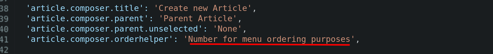

# Translating the menu / buttons

1. There are two files: `en.ts`, and `fi.ts`. Obviously, you'll be working with `fi.ts`  :)
2. As of this moment, `fi.ts` is a direct copy of `en.ts`
3. Each line has two parts: A left side and a right side. The left side corresponds the button or menu item to which that translation is matched. You'll be working with the right side, which is the actual text that the user will see.
3. All you need to do is translate the English content between the single quotes ' ' on the RIGHT SIDE of the item into Finnish. Please try not to delete any commas or quotation marks.

Check out this example screenshot. Each line will need the right side, underlined in red, to be translated:

